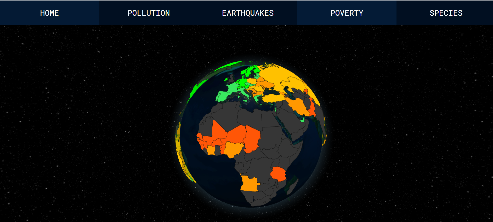

# Data Planet
A 3D data visualisation project that displays non-live datasets and live APIs onto our planet. The data is relevant to the UN's Sustainable Development Goals and focuses on:
- Poverty
- Climate change and air pollution
- Combatting endangerment of native wildlife


Created during the UQCS Hackathon 2022.
Teammates: @Antimatter543, @IsaacPikunic, @shirei220 and @SonjaMcNeilly. 

**Try it out [on this website](https://antimatter543.github.io/Dataplanet/)**.

Also there's a [youtube video](https://www.youtube.com/watch?v=OuOhGKdwWmc).
  
### Awards won:
"Best Community" award for that hackathon. Also won amazon's AWS ASDI Global Hackathon 2022 on Devpost out of 1600 participants. See UQCS showcase [here](https://uqcs.org/showcase/) and Devpost showcase [here](https://devpost.com/software/bigblueplanet).

## Instructions
1. Clone the repository
```
git clone https://github.com/Antimatter543/Dataplanet.git
```


2. Open index.html with a live server and enjoy!

